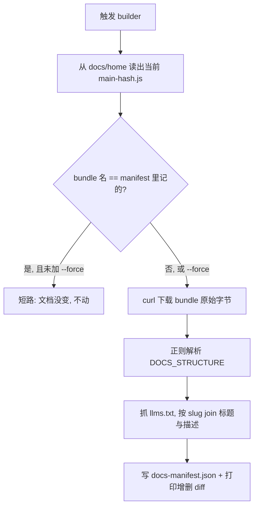

# Antigravity 文档索引构建器 Skill

这个 Skill 是 `antigravity-docs` 的**配套维护工具**。它做一件事:重新生成 `antigravity-docs` 依赖的那份 `docs-manifest.json`。你手动触发它(比如打 `/antigravity-docs-index-builder`),它就去 Antigravity 官网把最新的文档清单抽出来、写好。`antigravity-docs` 自己永远不会调它。

---

## 1. 它为什么必须存在

Claude Code 和 Codex 的文档页都有一个原始 `.md` 孪生页,直接抓就行。但 Antigravity 不一样:`antigravity.google/docs/*` 是**纯前端渲染的 SPA**。你直接抓一个文档页,只会拿到一个空壳;页面 URL 后面没有 `.md`,也没有 `llms-full.txt`。所以"靠抓页面来枚举文档列表"这条路在 Antigravity 上是走不通的。

但这个网站其实把"地图"和"正文"都以静态资源的形式发出来了,只是藏得深:

1. **JS bundle**(`main-<hash>.js`)里内嵌了一个 `DOCS_STRUCTURE` 数组,每条是 `{section, path, slug, filename}`——这就是所有文档页的权威清单。
2. **每页真正的 Markdown** 在 `https://antigravity.google/assets/docs/<path>/<filename>.md`,原汁原味带 frontmatter。这正是 `antigravity-docs` 要抓的东西。
3. **`llms.txt`** 里是 `- [标题](/docs/<slug>): 描述`,提供人类可读的标题和一句话描述,能按 `slug` 和 `DOCS_STRUCTURE` 精确 join(实测 66 条一一对上)。

这个构建器就是把 (1) 和 (3) 缝起来,再记录下 (2) 的地址,写成 manifest。

---

## 2. 怎么用

打 `/antigravity-docs-index-builder` 就行。它会自己跑 `scripts/build_manifest.py`:

- 先从 `https://antigravity.google/docs/home` 里读出当前的 `main-<hash>.js` 文件名;
- **如果这个文件名和 manifest 里记的一样,就直接短路**——bundle 没变,说明文档结构没变,什么都不做;
- 否则下载 bundle、解析 `DOCS_STRUCTURE`、抓 `llms.txt` join,写出新 manifest,并打印出"和上一版相比新增/删除了哪些页面"。

想强制重建(哪怕 bundle 没变),加 `--force`。跑完它会告诉你:bundle 名、页数、增删了哪些 slug。

一句话:你只要偶尔想刷新 Antigravity 文档索引,触发这个 Skill 就够了。

---

## 3. 一个关键陷阱:不能用 WebFetch

这是整个设计里最反直觉、也最容易踩的一点,单独拎出来讲。

`bundle` 必须以**原始字节**抓下来(`curl` / Python `urllib`),**绝对不能走 WebFetch 这类"把 HTML 转成 markdown"的抓取器**。因为 WebFetch 在转换时会把 `<script>` 标签整个丢掉,而我们要的 `DOCS_STRUCTURE` 数据恰恰就在 script 里。用 WebFetch 抓 bundle,你会得到一片空白。这就是为什么这个 Skill 的 `allowed-tools` 是 `Bash` 而不是 `WebFetch`——和 `antigravity-docs`(用 WebFetch 抓 `.md`)正好相反。

---

## 4. manifest 长什么样,为什么这么设计

生成出来的 `docs-manifest.json` 分两块。

`_meta` 记录溯源信息:生成日期、源 bundle 文件名、bundle 的 sha256、页数、内容 URL 的模板。这里最巧的一个设计是拿 **bundle 文件名当版本标记**。Antigravity 的 bundle 名是 `main-C7HXKFZQ.js` 这种带内容 hash 的形式,只要文档或代码变了,hash 就变、文件名就变。所以构建器只要比一下"当前 bundle 名 vs manifest 里记的 bundle 名",就能几乎零成本地判断"文档到底变没变",不用去逐页抓取比对。

`pages` 是 66 条文档记录,每条 `{section, slug, title, description, content_url}`。`title` 和 `description` 来自 `llms.txt`,给 `antigravity-docs` 做 triage 用;`content_url` 是拼好的 `.md` 地址,给它抓正文用。顺序保留了 `DOCS_STRUCTURE` 里的原始顺序,也就是官方的文档阅读顺序。

---

## 5. 出错了怎么办,以及几条纪律

脚本被刻意写成"宁可报错也不写出一份坏 manifest"。它在两种情况下会大声失败,而这两种都意味着 Antigravity 动了结构:

- **找不到 `main-<hash>.js`**:说明 app 壳的 HTML 变了。用 `curl -s https://antigravity.google/docs/home | grep -oE 'src="[^"]*"'` 看新的 bundle 引用长啥样,改 `find_bundle_name`。
- **找不到 `DOCS_STRUCTURE`**:说明 bundle 里那个数据结构变了。下载 bundle,`grep -oE '.{40}filename:"[^"]*".{20}' bundle.js` 看新的对象形状,改 `parse_structure`。

改完重跑,并在这个 Skill 的 `CHANGELOG.md` 里记一笔。

几条纪律:**永远不要手改 `docs-manifest.json`**——它是生成物,手改的东西下次一跑就被覆盖,要修就修构建器。**bundle 只能原始抓取**,理由见第 3 节。**留意 join 失败的页数**,少量没匹配上会退化成用 filename 造标题、可以接受,但大量没匹配通常意味着 bundle 和 `llms.txt` 的 slug 命名规则漂移了,得去看一眼。**别扩张职责**:这个构建器只负责写 manifest,不抓、不缓存正文——那是 `antigravity-docs` 在回答问题时才做的事。
