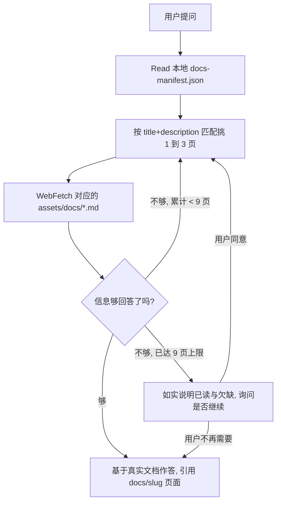

# Antigravity 文档索引 Skill

这个 Skill 让 agent 在需要了解 Google Antigravity 时,不再依赖训练时记住的、可能已经过期的知识,而是去读官方文档的最新版本。Antigravity 是个很新的产品,IDE、CLI、SDK、skills、MCP、权限模型都在快速变化,靠记忆回答很容易出错。这个 Skill 的作用就是把「先查官方文档、再回答」这件事固化成一个稳定流程。

它和 `claude-code-docs`、`codex-docs` 目标一致,但**取文档的机制不一样**——这是理解它的关键,下面会讲清楚。

---

## 1. 它解决什么问题

假设你要写一段关于 Antigravity 异步 subagent 的说明,或者在配置 CLI、MCP 时遇到报错,又或者想知道某个 agent 设置到底是什么含义。这些答案都在官方文档里,而且随时会更新。凭印象回答,你给出的命令、字段、slug 很可能已经被改掉了。

这个 Skill 覆盖 Antigravity 的全部文档范围:Antigravity 2.0(agentic IDE)、Antigravity CLI、SDK、以及 agents/subagents、models、skills、rules/workflows、hooks、MCP、browser、settings、enterprise、migration、FAQ。

---

## 2. 怎么用

大多数时候你什么都不用做。当你的任务依赖 Antigravity 的官方信息时,直接触发这个 Skill,它会自己完成查询。你可以把一个具体话题作为参数传进去(比如 `subagents` 或 `cli install`),也可以什么都不传,让它从当前对话里推断主题。

它的输出会落在真实文档内容上,并在陈述不那么显然的事实时附上文档标题和页面 URL,方便你回去核对。你从它这里拿到的不是一段综合了旧知识的复述,而是当前官方文档怎么说,它就怎么传达。

一句话总结前半段:只要你要做的事情依赖 Antigravity 的官方最新信息,参考这个 Skill 就够了。

---

## 3. 它和另外两个 docs skill 的关键区别

Codex 和 Claude Code 的文档页都有 `.md` 孪生页,所以那两个 Skill 直接抓页面 URL 就能拿到正文。**Antigravity 不行**:它的文档页是纯前端渲染的 SPA,你抓页面 URL 只会得到一个空壳。所以这个 Skill 换了一套机制:

- **索引是一个本地文件** `references/docs-manifest.json`,由配套的 `antigravity-docs-index-builder` Skill 生成。这个 Skill 直接 `Read` 它,**不去抓 `llms.txt`,也不爬网站**。
- **正文在另一个 `.md` 地址**(manifest 每条里的 `content_url`,位于 `/assets/docs/...` 下)。这个地址是能抓的,也正是它用 WebFetch 去抓的东西。

所以它的流程是:**读本地 manifest → 挑页面 → WebFetch 对应的 `content_url`**。这个"索引和正文分离"的设计,是 Antigravity 的 SPA 特性逼出来的,也是这个 Skill 最不一样的地方。

---

## 4. 工作流程是怎么设计的

Skill 的核心是一个「小批次 + 评估 + 循环」的过程。

第一步是读 manifest。它 `Read` 那个本地 JSON,里面有 `_meta`(生成日期、源 bundle)和 `pages`,每条是 `{section, slug, title, description, content_url}`。如果文件不存在,就提示用户先跑 `/antigravity-docs-index-builder`,而不是自己去猜 URL。

第二步是挑页面。拿用户的问题去和每条的 `title + description` 匹配,而不是只看 slug。一个批次只挑一到三页;具体功能问题对应一页;跨概念问题才分别挑多页;如果 manifest 里没有明显匹配的,就如实说没有(manifest 是完整的文档页清单,查不到要么确实不存在,要么 manifest 过期了,可以建议重建),绝不凭空造一个 `content_url`。

第三步是抓这一批。对每个选中的页面,WebFetch 它的 `content_url`(那个 `/assets/docs/....md` 地址),prompt 写成能捕捉用户真实需求的问题,而不是笼统的「总结这一页」。

第四步是评估,然后决定回答还是继续循环。抓完一批,先判断够不够回答。够了就作答并附出处(引用时用 `antigravity.google/docs/<slug>` 这个人能打开的页面地址,而不是 asset 地址);不够就回到第二步再挑一到三页。循环直到能回答,但最多读九页。读满九页还不够,就停下来,如实告诉用户已读了哪些、还缺什么,并询问要不要继续——不偷偷突破上限,也不用猜测凑答案。

---

## 5. 几条硬规则背后的道理

**读 manifest,不要爬站。** 页面清单和 `content_url` 只能来自 `references/docs-manifest.json`。永远不要去抓文档页 URL(SPA 空壳),也不要猜 `/assets/docs/...` 地址。这条是这个 Skill 和另外两个最大的不同,也是它可靠性的来源。

**小批次循环,九页封顶。** 一次抓一到三页,评估够不够,不够再抓,到九页还不够就先问用户。理由和另外两个 docs skill 一样:一次抓太多稀释信号,一批又常常不够,循环 + 上限在两者之间取平衡,而"到顶就问"是把"继续深挖还是打住"的判断交回用户。

**`content_url` 抓出来 404,意味着 manifest 过期了。** 说明上游把页面改名或删了。这时应该提示用户跑 `/antigravity-docs-index-builder` 刷新,而不是去猜新地址。这也正是"索引"和"消费"分成两个 Skill 的价值:内容层只管用,过期了交给构建器层去修。

**引用人能打开的页面。** 虽然抓的是 `/assets/docs/....md` 孪生文件,但引用给用户时要用 `antigravity.google/docs/<slug>`,那才是人点得开的地址。

**尽量原样传达文档内容,不要激进地和旧知识融合。** 用户要的是当前权威行为,而不是一份掺了过时假设的综述。

理解了这五节,你就明白这个 Skill 为什么把索引做成本地文件、为什么严格区分"抓 `.md` 正文 vs 猜 URL"、为什么把刷新的活儿甩给另一个构建器 Skill。它和 `antigravity-docs-index-builder` 是一对:构建器负责"文档地图始终新鲜",这个 Skill 负责"基于地图给出可靠答案"。
