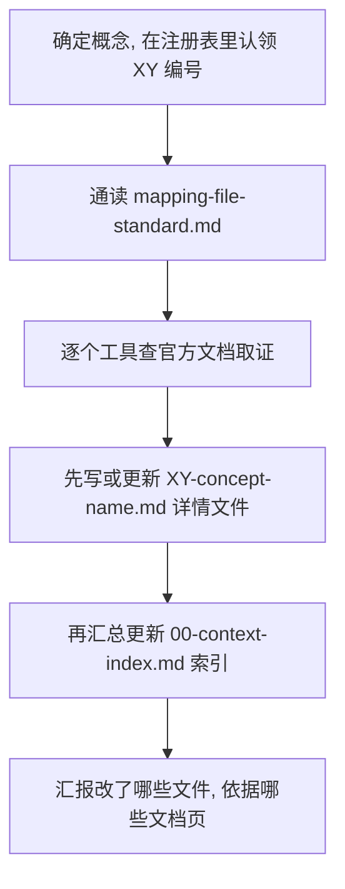

# Concept Mapping Builder Skill

这个 Skill 是概念映射知识库的「作者」。它负责把 Claude Code、Codex、Antigravity 三个 AI 编程工具里的项目级配置概念,横向对齐成一组结构一致、可核查的对照文档,并持续维护它们。真正回答问题、给读者查阅的是隔壁的 `coding-agent-concept-mapping` Skill,而那些文件是怎么写出来、怎么保持更新的,就归这个 builder 管。

---

## 1. 它解决什么问题

同一个概念,在不同工具里往往换了名字、换了文件位置、换了语法。Claude Code 的项目指令叫 `CLAUDE.md`,Codex 和 Antigravity 可能叫别的;skills、hooks、MCP、权限这些也都各有各的实现。如果只是把每个工具单独记一遍,读者真正想要的东西反而没有,也就是「我在 A 工具里的这套配置,搬到 B 工具该怎么写、有什么坑」。

这个 builder 的产物就是为了回答这个问题。它以 Claude Code 作为「种子」(seed),用 Claude Code 的概念词汇作为锚点,再去描述另外两个工具如何实现同一个概念,或者干脆没有对应物。核心价值不是三份互不相干的工具说明,而是它们之间的对齐关系,以及跨工具搬运时的注意事项。

---

## 2. 它维护哪些文件

所有产物都落在隔壁 `coding-agent-concept-mapping` Skill 的 `ref/` 目录下,分两类。

一类是每个概念一份的详情文件,命名为 `XY-concept-name.md`,`XY` 是两位数编号,概念名用小写短横线连接。这是真正承载内容的地方,也是每次先写的对象。

另一类是唯一的一份索引 `00-context-index.md`。它很短,是从详情文件汇总出来的一层「分诊」目录,让读者一眼看到全部概念并跳转到对应详情。它总是在详情文件写好之后才更新。

两类文件的确切格式,由本 Skill 的 [ref/mapping-file-standard.md](ref/mapping-file-standard.md) 规定。详情文件还配了一份可直接复制的骨架 [ref/concept-file-template.md](ref/concept-file-template.md)。

---

## 3. 两条硬约定,先理解再动手

第一条是列的顺序和 seed 模型。每一张对比表都固定三列,顺序是 Claude Code、Codex、Antigravity,永不改变。Claude Code 永远是第一列,因为它是定义概念的那把尺子。将来新增第四个工具时,只在每张表右边加一列,已有的列一个都不动。这就是整套设计保持 O(N) 的原因:加一个工具只加一列,而不是去补全每一对工具之间的关系。

第二条是每张表最后一行固定叫 `Porting-in notes`(转入注意事项)。每个工具一格,只回答一个问题:当有人把配置从别的工具搬进这个工具时,这个方面会踩什么坑。之所以这样写而不是穷举每一对迁移方向(那会是 N 乘 N 减一),是因为迁移的摩擦主要来自目标工具本身的怪癖,所以每个工具写一条「到我这里要注意什么」就够了。某个方面没什么坑时,那一格用一个短横线 `—` 占位。

---

## 4. 工作流程怎么走

流程的顺序是写死的:先详情,后索引。原因很直接,索引只是对详情文件已经确立的内容做摘要,先写索引等于去总结一份还不存在的内容。

取证这一步是重点,也是这个项目的立身之本。每一条不显然的事实都必须来自当前官方文档,而且要通过对应的文档查询 Skill 去拿,不能靠记忆。Claude Code 列走 `claude-code-docs`,Codex 列走 `codex-docs`,Antigravity 列走 `antigravity-docs`。这三个文档 Skill 存在的理由,正是因为这些工具几乎每周都在变,训练时记住的知识很容易过期。查过的文档页标题和链接,最后落在每份详情文件底部的 `Sources` 小节里,方便后来的人不必重新调研就能复核。

当某个工具确实没有对应物时,写 `No equivalent` 加一句上下文,绝不留空格。空格是含糊的,它读起来像「忘了填」而不是「确实没有」,所以永远不被接受。

---

## 5. 几条规则背后的道理

先详情后索引,是为了避免总结一份尚不存在的内容,同时保证索引里的每句话都能在详情文件里找到出处。一旦两者不一致,以详情文件为准,回头去修索引。

一切以官方文档为准、不用记忆回填,是因为读者要的是当前权威行为,而不是一份掺了过时假设的复述。查不到就老实标 `unconfirmed` 或者删掉那一行,不把没把握的东西包装成确定的结论。

以 Claude Code 为 seed、固定列顺序,是为了让整套知识库共享同一套词汇,不至于裂成三份各说各话的术语表,也让加新工具这件事永远只是「加一列」。

范围要收窄,只收项目级、可移植的配置概念,是因为知识库的价值在于跨工具对齐。一个只存在于单个工具的概念没有可对齐的对象,放进来只会稀释信号,所以不收。
