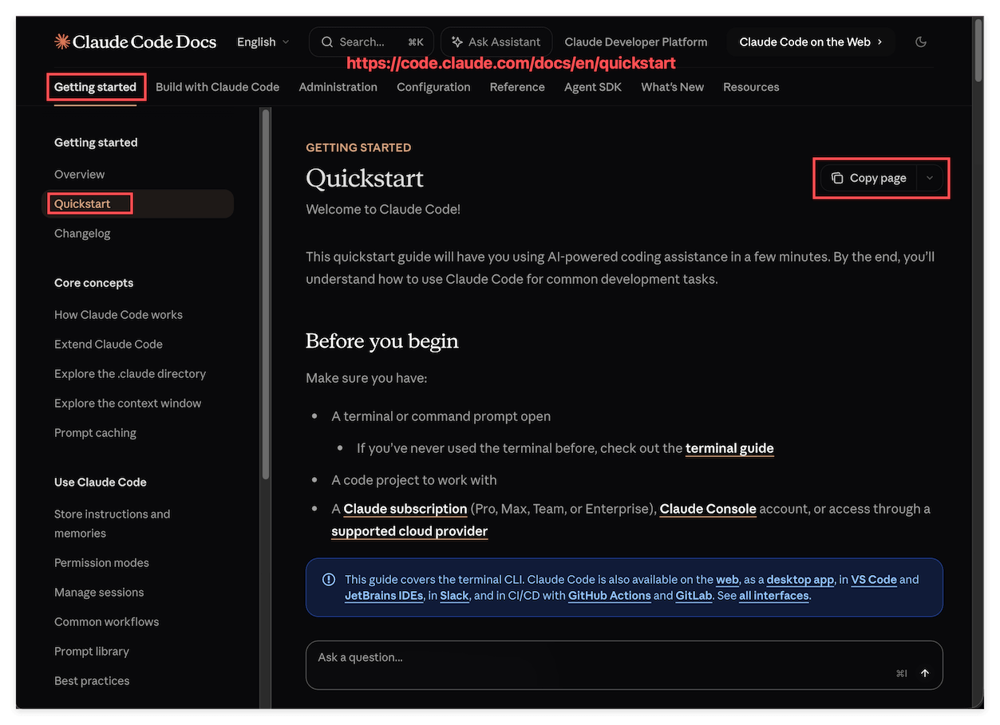

# 第一层专家, 是怎么被真的造出来的

## 1. 这一篇只挖第一层

上一篇讲到, 这个 repo 已经用同一套方法造出了三个专家 agent, [`claude-code-docs`](../../.claude/skills/claude-code-docs/SKILL.md), [`codex-docs`](../../.claude/skills/codex-docs/SKILL.md), [`antigravity-docs`](../../.claude/skills/antigravity-docs/SKILL.md), 分别是 Claude Code, Codex, Antigravity 各自的专家. 但上一篇讲得太粗, 只停留在 "有三个专家" 这个结论上, 没有真正打开看看一个专家是怎么从零被造出来的.

这个 repo 其实是三层叠加的, 专家层只是最底下第一层, 上面还有对齐概念的第二层, 和真正执行迁移的第三层. 三层一次性讲, 每一层都只能点到为止, 反而讲不透. 所以这一篇刻意只挖第一层, 而且只用一个专家举例, 也就是 [`claude-code-docs`](../../.claude/skills/claude-code-docs/SKILL.md), 把它从发现到成型的整个过程, 一步一步摊开给你看. 第二层和第三层放到后面单独一篇细讲.

---

## 2. 从一个网页, 和一个不起眼的按钮开始

事情要从打开 Claude Code 的官方文档网站说起. 翻到 Getting started 底下的 Quickstart 页面, 页面右上角有一个容易被忽略的按钮, Copy page.



大部分人翻文档, 顶多是用眼睛读一读页面上渲染出来的文字. 但这个按钮暗示了一件事: 这个页面背后, 存在一份跟渲染结果对应的, 结构化的原始内容. 点一下这个按钮, 复制到的到底是什么, 值得深挖下去.

---

## 3. 复制下来的内容里, 藏着一条线索

点开 Copy page 复制到的, 是这个页面对应的原始 Markdown, 完整内容存在 [claude-code-quick-start.md](./claude-code-quick-start.md) 里. 开头几行是这样的:

```markdown
> ## Documentation Index
> Fetch the complete documentation index at: https://code.claude.com/docs/llms.txt
> Use this file to discover all available pages before exploring further.

# Quickstart

> Welcome to Claude Code!
```

这几行不起眼, 但信息量很大. 它在明确告诉任何一个来读这份 Markdown 的人, 不管是人还是 agent, 这个网站有一份专门列出全部文档的索引文件, 地址就是 `https://code.claude.com/docs/llms.txt`. 这不是页面正文的一部分, 更像是网站自己主动留下的一条路标, 指向一份更完整的地图.

---

## 4. 顺着线索挖到底, 找到整个网站的索引

顺着这条路标去把 `llms.txt` 抓下来, 内容存在 [claude-code-llm.txt](./claude-code-llm.txt) 里, 摘一小段感受一下它的样子:

```markdown
- [Explore the .claude directory](https://code.claude.com/docs/en/claude-directory.md): Where Claude Code reads CLAUDE.md, settings.json, hooks, skills, commands, subagents, workflows, rules, and auto memory.
- [Authentication](https://code.claude.com/docs/en/authentication.md): Log in to Claude Code and configure authentication for individuals, teams, and organizations.
```

打开一看, 整个网站几百个文档页面, 每一页的标题, 简介, 链接, 全部被压成了一份平铺的列表, 而且每一条链接末尾都是 `.md`, 也就是说这些链接指向的不是渲染出来的网页, 而是可以直接抓取的原始 Markdown 文本, 不需要跑一个浏览器去渲染 JS, 也不需要费劲从 HTML 里把正文抠出来.

这一刻的反应是: 这不就是一个绝佳的机制吗. 一份索引, 覆盖全站, 机器可读, 每一条都能直接换成一次干净的抓取. 如果一个 agent 手上有这份索引, 它理论上就能按需去查任何一页, 而不需要把整个网站背下来.

---

## 5. 先验证, 再动手

发现一个看起来很美的机制, 不能直接就当真去用, 万一这只是这一个页面的巧合, 或者是某次改版留下的临时产物, 那造出来的东西一开始就建立在流沙上.

所以下一步不是急着去写 Skill, 而是把这个发现丢给 Claude 去联网搜索确认: `llms.txt` 是不是一个被广泛采用的, 官方承认的公开约定, 而不是 Claude Code 文档站自己拍脑袋搞出来的东西. 确认下来, 它确实是一套越来越多网站在用的, 面向 AI agent 的标准做法, 用来告诉来访的 agent, 这里有一份完整索引, 请按需查阅, 不用整站爬取. 有了这层确认, 这个机制才算是站得住脚, 值得把它固化成一个可以长期依赖的能力, 而不是一次性的运气.

---

## 6. 把发现写成一个 Skill, 测试它, 现在它是我的专家

确认机制可靠之后, 才是真正动手的时候. 用 [`write-agent-skill`](../../.claude/skills/write-agent-skill/SKILL.md) 这个专门用来写 Agent Skill 的工具, 把刚刚发现的整套机制, 写成了 [`claude-code-docs`](../../.claude/skills/claude-code-docs/SKILL.md) 这个 Skill.

写进去的不是某几条具体的文档知识, 而是一套动作规则, 也就是 agentic search 的逻辑: 先读 `llms.txt` 拿到索引, 按问题去匹配最相关的条目, 每次只批量抓 1 到 3 页, 抓完先判断够不够回答问题, 不够就再抓下一批, 一直到累计抓够 9 页还是不够, 就停下来老实告诉用户目前读到了什么, 还缺什么, 问要不要继续. 这条规则背后的算盘很直接: 一个网站有几百页文档, 没有必要把全站一次性塞进 context, 按需去抓, 既省 token, 又保证读到的永远是当前版本.

Skill 写完不能直接信它管用, 得测试. 随便在文档网站上找几个之前完全没看过的页面, 换几个跟 Quickstart 毫不相关的问题去问这个新写好的 [`claude-code-docs`](../../.claude/skills/claude-code-docs/SKILL.md), 结果它每次都能顺着索引定位到对的那一页, 抓下来, 给出有依据的回答.

到这一步, 从一个 Copy page 按钮开始的这条线, 才算真正走完: 发现一个机制, 验证它是不是可靠, 把它写成一套可以重复调用的规则, 再测试它是否真的管用. 走完这一整套流程之后, 手上多出来的不是一份文档摘抄, 而是一个随身携带, 随时可以问的 Claude Code 专家. 这正是上一篇说的 "教你造一个教你的专家" 在第一层上的完整落地, 也是这个 repo 最底下这层, 真正被造出来的样子. 第二层怎么让这三个专家学会互相对照, 第三层怎么把这种对照真的用来做迁移, 留到下一篇细讲.
