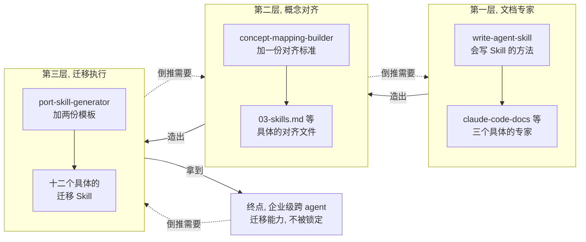

# 第二, 三层, 是怎么被真的造出来的

## 1. 这一篇要把二, 三层补完

[第一篇](../01-why-this-repo-matters/README-cn.md) 介绍过这个 repo 的三层结构, 三层专家老师叠在一起, [第二篇](../02-building-the-first-expert/README-cn.md) 只挖了第一层, 用 [`claude-code-docs`](../../.claude/skills/claude-code-docs/SKILL.md) 这一个例子, 完整走了一遍发现, 验证, 编码, 测试. 第一层解决的问题是: 面对一个会持续变化的工具, 怎么造一个永远读最新文档, 不会背旧答案的专家.

但三个专家造出来之后, 一个新问题马上冒出来: 这三个专家各自守着自己的地盘, 谁也不知道另外两个专家嘴里说的东西, 跟自己说的是不是同一件事. 这一篇要把剩下的两层完整摊开: 第二层怎么让三个专家学会互相对照, 第三层怎么把这种对照真的用来做迁移. 这两层比第一层厚, 所以这一篇会比前几篇长一些.

---

## 2. 为什么要造二, 三层, 不是因为好奇心

Claude Code, Codex, Antigravity 各自有自己独有的地方, 这是没办法的事, 别的工具用不了, 也没必要用得了. 但抛开这些独有的部分, 三者之间有大量的概念其实是共通的: project 级别的提示文件, 设置, skills, 自定义命令, hooks, MCP servers, subagents, permissions, 这些概念三边都有, 只是长得不完全一样. 看不见这层共通性, 会实实在在地踩到两个坑, 而这两个坑, 正好对应二, 三层各自真正要解决的问题.

第一个坑, 跟学习有关. 三个工具都在不停地加新功能, 出新文档, 如果每一个都要从头单独吃透, 学习成本会摊得很薄很累. 真正想要的做法是, 把主要精力砸在吃透一个工具上, 也就是第一篇, 第二篇已经做完的事, 剩下两个工具, 靠着这层共通性, 用类比的方式快速学会, 而且不是那种 "哦它好像也有这个东西" 的模糊印象, 而是精确知道具体该怎么做. 这正是第二层, `concept-mapping`, 真正的原动力: 它是一台学习加速器, 让在一个工具上练出来的深度, 能精确地转译到另外两个工具上, 而不需要把三份深度掌握各自从头练一遍.

第二个坑, 跟企业里的真实利益有关, 这是第三层真正要解决的问题, 分量比听起来更重. 一个团队如果把工作流深度绑死在某一个 agent 特有的写法上, 换平台的时候就会撞上 vendor lock-in, 想搬家却搬不动, 因为所有东西都长在这一个工具的专有格式里. 而如果这套配置本来就是可迁移的, 能批量, 低成本地搬到别的工具上, 就完全不怕被锁定, 换平台从一件大工程变成一次随时可以执行的操作. 这才是第三层真正的分量所在, 也是这整件事真正的企业级价值.

先把这两条动机立住, 后面的实现细节才有地方挂, 不然讲得再细, 也只是一堆各自孤立的技术操作.

---

## 3. 第二层要解决的问题, 三个专家各自为政

回到具体场景, 而且拿一个大家已经很熟的概念举例, 也就是 skill 本身: 你想知道一个 Claude Code 项目里的 skill, 目录该放在哪, `SKILL.md` 里的字段该怎么写, 换到 Codex 和 Antigravity 项目里, 又该怎么放, 怎么写. 最直接的办法, 是分别去问三个专家, [`claude-code-docs`](../../.claude/skills/claude-code-docs/SKILL.md) 讲 Claude Code 的 skill 怎么组织, `codex-docs` 讲 Codex 的又是怎么放的, `antigravity-docs` 讲 Antigravity 的规矩. 三次问答问下来, 答案分散在三处, 得自己在脑子里拼一遍, 而且这次拼好的结论, 没有地方留下来, 下一次有人问同样的问题, 又要重新拼一遍, 完全没有沾到上一段说的那种学习加速的光.

这还只是 skill 这一个概念. project 级别的配置概念不止这一个, 每一个都要经历一遍这种分散, 拼接, 白费的过程. 三个专家很懂自己的工具, 但没有一个专家负责记住三者之间的对应关系, 这正是第二层要补上的空白.

---

## 4. 从一个具体概念看对齐是怎么做的, 以 skill 为例

对齐关系写在 [`concept-mapping`](../../.claude/skills/concept-mapping/SKILL.md) 这个知识库里, 每个概念一份文件. 拿 skill 举例, [`03-skills.md`](../../.claude/skills/concept-mapping/ref/03-skills.md) 开头是一段定义, 说清楚 skill 是什么, 三个工具是不是都有这个概念, 然后往下拆成几个方面, 每个方面一张表. 摘一段感受一下它的样子:

```markdown
## 1. Directory structure and location

Every tool treats a skill as a folder whose entry file is `SKILL.md`,
discoverable at several scopes. The paths differ: Claude Code keeps skills
under `.claude/skills/`, while Codex and Antigravity both use the tool
neutral `.agents/skills/`.

| Dimension | Claude Code | Codex | Antigravity |
|---|---|---|---|
| Project | `.claude/skills/<name>/` | `.agents/skills/<name>/`, scanned from the cwd up to the repo root | `.agents/skills/<name>/` (legacy `.agent/skills/`) |
| Porting-in notes | move any `.agents/skills/` folders to `.claude/skills/`, since Claude Code does not read the neutral path | the `.agents/skills/` path is shared with Antigravity, so a repo's project skills often load as is | project skills share the `.agents/skills/` path, but the global path is documented inconsistently across pages, so keep skills in the repo folder |
```

这份文件不是凭印象写的. 每一格数据背后, 都是先问过对应的专家才落笔, Claude Code 那一列问的是 `claude-code-docs`, Codex 那一列问的是 `codex-docs`, Antigravity 那一列问的是 `antigravity-docs`, 文件末尾还留了一份 Sources 清单, 记着到底读了哪几页文档, 方便以后重新核对. 这跟第一层是同一条规矩: 不背印象, 只信现读的官方文档. 这一段本身也是一个巧合的印证: 你现在读的这整个教程, 就是靠这个 skill 概念一路撑起来的, 用它自己举例, 比拿一个陌生概念举例要好懂得多.

---

## 5. 一个关键设计, porting-in notes 怎么避免组合爆炸

三个工具两两互相迁移, 一共有六个方向. 如果每个方面都要写清楚 "从 Claude Code 搬到 Codex 要注意什么", "从 Codex 搬到 Claude Code 要注意什么", "从 Claude Code 搬到 Antigravity 要注意什么", 这样每加一个方向, 表格就要多一整套内容, 工具一多, 方向数会以平方的速度膨胀.

这份知识库用了一个更省事的设计, 上面那张表最后一行, `Porting-in notes`, 每个工具一格, 只回答一个问题: 别人的 skill 要搬到这个工具上时, 目录结构这方面会踩到什么坑. Claude Code 那一格说的是把 `.agents/skills/` 挪到 `.claude/skills/` 下, Codex 那一格说的是这个路径本来就跟 Antigravity 共用, 通常照搬就能用, Antigravity 那一格提醒全局路径文档写得不一致, 干脆把 skill 都留在仓库目录里. 这一行不是按方向写的, 是按目的地写的, 因为搬迁的麻烦大多出在到达那一端. 三个工具, 三个目的地, 只要三格, 不管以后再加几个方向, 都不用重写这一行. 这跟第三层要造十二个迁移工具时会再次遇到的思路是一样的, 不必要的重复, 想办法用一个更聪明的结构避开.

---

## 6. 先造一个会写对齐文件的 agent, 再去写 skill 这份对齐文件

`03-skills.md` 这份文件不是有人坐下来直接写出来的. 写这些概念文件不是一次性的活, 概念会新增, 工具文档会更新, 而且这个知识库以后不止 skill 一个概念, project prompt, settings, hooks, MCP servers, subagents, permissions 迟早都要各来一份, 每一份都要长得像同一个人写的. 如果没有一份写死的标准, 这么多概念文件写下来, 迟早会有一份的表格列序, 术语口径跟别的不一样.

所以顺序是反过来的: 先造出一个专门负责维护这份知识库的 agent, [`concept-mapping-builder`](../../.claude/skills/concept-mapping-builder/SKILL.md), 它遵守一份写死的标准, [`mapping-file-standard.md`](../../.claude/skills/concept-mapping-builder/ref/mapping-file-standard.md), 规定了每份概念文件的形状, 表格的列序, 术语的口径, 以及最重要的一条: 每一条结论都要能在三个专家那里查到出处, 不能凭训练记忆写. 有了这个 builder, 才轮到它去写 `03-skills.md`, 以及以后每一份新的概念文件, 这跟第一层先有 [`write-agent-skill`](../../.claude/skills/write-agent-skill/SKILL.md) 这个会写 Skill 的方法, 再用它写出 `claude-code-docs`, 是同一个先后顺序.

维护顺序也是固定的, 先改具体的概念文件, 后改汇总索引 [`00-context-index.md`](../../.claude/skills/concept-mapping/ref/00-context-index.md), 索引只是一份用来导航的短清单, 从来不是新事实第一次出现的地方. 而真正在回答问题时用的, 是只读的 [`concept-mapping`](../../.claude/skills/concept-mapping/SKILL.md), 它的动作很简单: 先读索引找到该看哪份概念文件, 再打开那份文件, 照着里面已经核实过的内容回答, 自己不编新结论.

---

## 7. 第三层要解决的问题, 知道怎么对应, 但活儿还没干

有了第二层, 你已经能查到, Claude Code 的 skill 目录结构搬到 Codex 上要注意什么. 但知道要注意什么, 跟真的把一个项目里的 skill 文件夹从 Claude Code 的路径改写成 Codex 的路径, 还是两件事. 前者是查资料, 后者是动手做, 而前面说过, 动手做这一步, 正是解决 vendor lock-in 的地方: 光知道怎么搬没有用, 得真的能搬, 而且搬得够快够便宜, 锁定才谈得上被解除. 第三层要补的就是这个动手的部分.

三个工具两两互相迁移, 一共六个方向, 每个方向还需要两个角色, 一个真正执行迁移, 一个只读地检查搬得全不全, 把差距写成一份报告, 而不是让执行迁移的那个工具自己给自己打分. 算下来, 一共十二个 Skill.

---

## 8. 先造生成器, 再造十二个具体的 port agent

十二份几乎同构, 只是换了源和目标名字的文件, 手写手改是一条很容易走样的路, 改了这一份忘了改另一份, 十二份很快就会互相不一致. 这里再一次出现前两层都出现过的顺序: 不是先写出十二个具体的迁移 Skill, 而是先造一个专门负责生产它们的 agent, [`port-skill-generator`](../../.claude/skills/port-skill-generator/SKILL.md), 它手上握着两份模板, 一份 [`port-skill-template.md`](../../.claude/skills/port-skill-generator/ref/port-skill-template.md), 一份 [`checker-skill-template.md`](../../.claude/skills/port-skill-generator/ref/checker-skill-template.md), 模板里用 `{{SOURCE_NAME}}`, `{{TARGET_NAME}}` 这样的占位符代替具体的工具名. 有了这个生成器, 才轮到它去套出十二个真正能跑的 port Skill, 跟第一层先有 `write-agent-skill` 再造出 `claude-code-docs`, 第二层先有 `concept-mapping-builder` 再造出 `03-skills.md`, 是同一个套路重复了第三次.

开发者敲一条 `/port-skill-generator cc to cdx`, 生成器解析出源是 Claude Code, 目标是 Codex, 算出所有占位符该替换成什么, 把两份模板套出两个真正的 Skill 文件. 想改所有迁移工具共有的行为, 只改这两份模板, 重新跑一遍生成器就够了, 不会有某一个方向悄悄跟其他十一个走样. 三个工具的名单是写死在生成器里的, 因为加一个新 agent 是很少见的事, 但这份写死的名单只管工具叫什么, 不管要迁移哪些概念.

---

## 9. 生成出来的技能, 也不把概念清单焊死在身上

模板里刻意留了一条规矩, 摘一段感受一下:

```markdown
## Do not hardcode the concept list

The set of portable configuration concepts (project prompt, settings, skills,
custom commands, hooks, MCP servers, subagents, permissions, and more) grows
over time. Never rely on a list baked into this skill. The authoritative,
current list lives in the concept mapping knowledge base, which you read
fresh every run.
```

也就是说, 生成出来的十二个 Skill, 每一个运行的时候, 都会现读第二层的 `00-context-index.md`, 拿到当前完整的概念清单, 再挨个去查每个概念该怎么搬. 新增一个概念, 完全不用碰这十二个 Skill, 只要第二层更新了, 十二个 Skill 就自动跟着更新. 执行迁移的那一个负责真的创建或修改目标文件, 只读检查的那一个负责扫描两边, 把搬得全不全, 哪里缺了, 写成一份固定格式的报告, 存在项目的 `tmp/review-<port 技能名>.md` 里, 自己不动手改任何东西.

---

## 10. 三层现在真的连起来了

到这里, 三层第一次真正串成了一条能干活的链路. 第一层负责发现和读取三个工具各自的官方文档, 现读, 不背旧答案. 第二层负责把同一个概念在三个工具里的样子对齐, 每一条结论都回头问第一层, 不凭记忆编. 第三层负责真正执行或者审查一次迁移, 每次运行都回头问第二层要最新的概念清单, 不把清单焊死在自己身上.

信息只往上走一次, 而且永远是现问, 不是缓存下来的旧答案. 这也是为什么加一个新概念, 或者某个工具改了文档, 影响能顺着这条链路一路传上去, 而不需要人工去十二个地方逐一同步.

---

## 11. 回头看, 同一个模式跑了四次, 也就是 1 + 3

三层各自面对的具体问题不一样, 第一层要跟文档的更新速度赛跑, 第二层要跟组合爆炸赛跑, 第三层要跟手工维护的走样风险赛跑, 但用来解决问题的思路, 其实是同一招, 在三层内部各跑一次, 再在三层之上跑一次, 也就是[第一篇](../01-why-this-repo-matters/README-cn.md) 说的 1 + 3: 不要直接造出那个最终想要的答案, 而是造一个能持续, 正确地产出那个答案的机制, 而且这个机制永远向下一层现取最新状态, 绝不把下一层的东西复制一份焊死在自己身上. 画成一张图会更直观:



三个子图内部, 都是先有一个负责生产的 agent (实线箭头左边), 再有具体的产出 (实线箭头右边), 这是一次一次的小以终为始. 三个子图连起来, 再加上最右边那个终点, 沿虚线倒着看回去, 又是一次更大的以终为始: 先认定终点是企业级的跨 agent 迁移能力, 倒推出需要第三层, 第三层倒推出需要第二层, 第二层倒推出需要第一层. 小的套在大的里面, 形状完全一样.

这里还有一层更深的对称, 值得在收尾时点破. 第一层本身, 其实已经用了一次以终为始: 认定要有一个不会过时的专家, 倒着推出发现, 验证, 编码, 测试这四步. 但放在整个三层里看, 这一次小的以终为始, 只是在给更大的目标打地基. 如果把一, 二, 三层看成一次更大的以终为始, 目标是拿到能在企业里真正落地的跨 agent 迁移能力, 那么第一层就是嵌在这个大目标里面的一个小号版本, 同一个思维模型, 用在了两种尺度上.

打好这层地基, 再拿下第三层, 拿到手的就不再是某一个 agent 用得多熟练, 而是所有 agent 一起拿下, 因为学习加速让你精确掌握了每一个, 迁移能力让你不被任何一个锁定. 这才是这三层真正收敛到的地方: 掌握的不是一个工具, 而是掌握工具这件事本身, 以后再出现第四个, 第五个 agent, 这套方法都一样适用.

[第一篇](../01-why-this-repo-matters/README-cn.md) 说过, 深度掌握 agent, 掌握的不该是某几份具体的知识, 而是能不能看懂并且复刻这种造机制的思路. 现在这三层的底层实现都摊开了, 接下来要看的是, 面试官顺着这三层往下追问的时候, 该怎么接.
