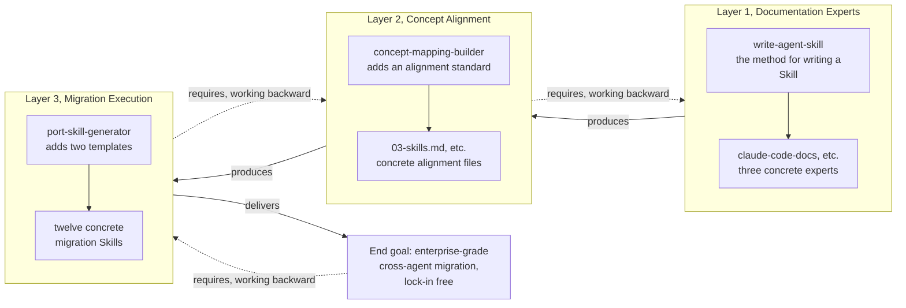

# How Layers Two and Three Actually Get Built

## 1. Finishing the Job on Layers Two and Three

[The first article](../01-why-this-repo-matters/README.md) introduced this repo's three-layer architecture — three tiers of expert-teachers stacked on each other — and [the second article](../02-building-the-first-expert/README.md) only dug into layer one — using [`claude-code-docs`](../../.claude/skills/claude-code-docs/SKILL.md) as the single example, it walked through the full cycle of discovery, verification, coding, and testing. Layer one solves this problem: given a tool that keeps changing, how do you build an expert who always reads the latest docs instead of reciting stale answers.

But the moment you've built three experts, a new problem shows up immediately: each of the three experts guards its own turf, and none of them knows whether what it says lines up with what the other two are saying. This article lays out the remaining two layers in full: how layer two teaches the three experts to cross-check each other, and how layer three actually puts that cross-checking to work in real migrations. These two layers are meatier than layer one, so this article runs longer than the previous ones.

---

## 2. Why Build Layers Two and Three — It's Not Just Curiosity

Claude Code, Codex, and Antigravity each have their own quirks, and that's unavoidable — other tools can't use them, and there's no need for them to. But set those quirks aside, and there's a large shared surface across all three: project-level prompt files, settings, skills, custom commands, hooks, MCP servers, subagents, permissions — every one of these concepts exists on all three sides, just dressed up a little differently. Missing that shared surface means you'll walk straight into two specific traps, and those two traps map exactly onto what layers two and three are each meant to fix.

The first trap is about learning. All three tools keep shipping new features and new docs, and if you have to master each one from scratch independently, the learning cost gets spread thin and wears you out. What you actually want is to pour your main effort into mastering one tool deeply — which is exactly what the first and second articles already did — and then use that shared surface to pick up the other two quickly by analogy. Not the fuzzy "oh, it probably has something like that too" kind of analogy, but precise knowledge of exactly what to do. This is the real motivation behind layer two, `concept-mapping`: it's a learning accelerator, letting the depth you built on one tool translate precisely onto the other two, instead of having to grind out that same depth three separate times.

The second trap concerns real enterprise stakes, and it's the problem layer three actually exists to solve — it carries more weight than it sounds like. If a team wires its workflows deeply into one agent's proprietary conventions, switching platforms later runs straight into vendor lock-in: they want to move but can't, because everything is grown into that one tool's private format. But if the configuration is portable from the start — if it can be moved to another tool in bulk, cheaply — lock-in simply isn't a threat, and switching platforms turns from a massive undertaking into something you can do on demand. This is where layer three's real weight lives, and it's the true enterprise-grade value of the whole endeavor.

Getting these two motivations straight first gives the implementation details that follow somewhere to hang — otherwise, no matter how carefully we walk through the mechanics, it's just a pile of disconnected technical moves.

---

## 3. The Problem Layer Two Solves: Three Experts, Each Minding Their Own Business

Let's ground this in a concrete scenario, using a concept you're already comfortable with: the skill itself. Say you want to know where a skill's directory should live in a Claude Code project, and how the fields in `SKILL.md` should be written — then how that changes for a Codex or Antigravity project. The most direct approach is to ask all three experts separately: [`claude-code-docs`](../../.claude/skills/claude-code-docs/SKILL.md) explains how Claude Code organizes skills, `codex-docs` explains how Codex lays them out, and `antigravity-docs` explains Antigravity's rules. After three separate rounds of Q&A, the answer is scattered across three places, and you have to stitch it together yourself in your head. Worse, once you've stitched it together, there's nowhere to save that conclusion — the next person who asks the same question has to redo the stitching from scratch, gaining none of the learning-acceleration benefit described above.

And that's just for the concept of "skill." There's more than one project-level configuration concept, and every single one would have to go through this same cycle of scattering, stitching, and wasted effort. All three experts know their own tool well, but none of them is responsible for remembering how the three map onto each other — and that's precisely the gap layer two fills.

---

## 4. Seeing How Alignment Works Through One Concrete Concept: Skills

The alignment data lives in the [`concept-mapping`](../../.claude/skills/concept-mapping/SKILL.md) knowledge base, one file per concept. Take skills as the example: [`03-skills.md`](../../.claude/skills/concept-mapping/ref/03-skills.md) opens with a definition that pins down what a skill is and whether all three tools even have the concept, then breaks the topic down into several dimensions, one table per dimension. Here's a taste of what it looks like:

```markdown
## 1. Directory structure and location

Every tool treats a skill as a folder whose entry file is `SKILL.md`,
discoverable at several scopes. The paths differ: Claude Code keeps skills
under `.claude/skills/`, while Codex and Antigravity both use the tool
neutral `.agents/skills/`.

| Dimension | Claude Code | Codex | Antigravity |
|---|---|---|---|
| Project | `.claude/skills/<name>/` | `.agents/skills/<name>/`, scanned from the cwd up to the repo root | `.agents/skills/<name>/` (legacy `.agent/skills/`) |
| Porting-in notes | move any `.agents/skills/` folders to `.claude/skills/`, since Claude Code does not read the neutral path | the `.agents/skills/` path is shared with Antigravity, so a repo's project skills often load as is | project skills share the `.agents/skills/` path, but the global path is documented inconsistently across pages, so keep skills in the repo folder |
```

None of this was written from memory. Every cell in that table was filled in only after asking the corresponding expert first: the Claude Code column came from querying `claude-code-docs`, the Codex column from `codex-docs`, the Antigravity column from `antigravity-docs`. The file even keeps a Sources list at the bottom recording exactly which doc pages were read, so it can be re-verified later. This is the same rule layer one follows: never work from memory, only from docs you just read. And there's a nice bit of self-reference here too — the very tutorial you're reading right now was built on top of this same skill concept, so using it as the example is a lot easier to follow than reaching for something unfamiliar.

---

## 5. A Key Design Choice: How "Porting-In Notes" Avoid Combinatorial Explosion

With three tools, migrating pairwise between them gives you six directions. If every dimension had to spell out "what to watch for moving from Claude Code to Codex," "what to watch for moving from Codex to Claude Code," "what to watch for moving from Claude Code to Antigravity," and so on, then every time you added a direction, the table would need a whole new set of content — and as tools multiply, the number of directions grows quadratically.

This knowledge base uses a much cheaper design instead. Look at the last row of the table above, `Porting-in notes`: one cell per tool, and each cell answers exactly one question — when someone else's skill gets moved onto this tool, what trips people up about directory structure. The Claude Code cell says to move `.agents/skills/` under `.claude/skills/`; the Codex cell says this path is already shared with Antigravity, so it usually just works as-is; the Antigravity cell warns that the global path is documented inconsistently, so it's simplest to just keep skills inside the repo. This row isn't organized by direction — it's organized by destination, because migration headaches mostly show up on the receiving end. Three tools, three destinations, three cells — and no matter how many more directions get added later, this row never needs a rewrite. This is the same idea that shows up again in layer three, when it comes time to build twelve migration tools: avoid unnecessary duplication by reaching for a smarter structure instead.

---

## 6. Build an Agent That Writes Alignment Files First, Then Write the Skill Alignment File

`03-skills.md` wasn't something someone just sat down and wrote. Writing these concept files isn't a one-time job — new concepts keep appearing, tool docs keep changing, and this knowledge base is eventually going to need entries beyond just skills: project prompts, settings, hooks, MCP servers, subagents, permissions will all need their own file sooner or later, and every one of them needs to read as if the same person wrote it. Without a fixed standard, sooner or later one of these concept files will end up with a different column order or different terminology than the rest.

So the order is reversed: first build an agent dedicated to maintaining this knowledge base, [`concept-mapping-builder`](../../.claude/skills/concept-mapping-builder/SKILL.md), which follows a fixed standard, [`mapping-file-standard.md`](../../.claude/skills/concept-mapping-builder/ref/mapping-file-standard.md). That standard specifies the shape of every concept file, the column order of the tables, the terminology conventions, and — most importantly — the rule that every claim must be traceable back to one of the three experts, never written from training memory. Only once this builder exists does it get to work writing `03-skills.md`, and every concept file that comes after it. This is the exact same sequencing as layer one, where [`write-agent-skill`](../../.claude/skills/write-agent-skill/SKILL.md) — the method for writing a Skill — came first, and `claude-code-docs` came out of using it.

The maintenance order is fixed too: update the specific concept file first, and only then update the summary index, [`00-context-index.md`](../../.claude/skills/concept-mapping/ref/00-context-index.md). The index is just a short navigational list — it's never where a new fact appears for the first time. What actually gets used when answering questions is the read-only [`concept-mapping`](../../.claude/skills/concept-mapping/SKILL.md) skill, and its job is simple: read the index to find which concept file to open, then open that file and answer using what's already been verified in it, without inventing new conclusions of its own.

---

## 7. The Problem Layer Three Solves: Knowing How to Map Things Isn't the Same as Doing the Work

With layer two in place, you can now look up what to watch out for when moving a Claude Code skill's directory structure over to Codex. But knowing what to watch out for is a different thing from actually rewriting a project's skill folder from Claude Code's path convention to Codex's. The first is research; the second is doing the work — and as mentioned earlier, it's that second step, the actual doing, where vendor lock-in gets solved. Knowing how to migrate isn't worth much on its own; you have to actually be able to migrate, and cheaply and quickly enough that lock-in is meaningfully removed. Layer three is what fills in that hands-on part.

Six migration directions across three tools, and each direction needs two roles: one that actually executes the migration, and one that only reads and checks whether the migration is complete, writing the gaps up as a report — rather than letting the tool that did the migrating grade its own work. That comes out to twelve Skills in total.

---

## 8. Build the Generator First, Then the Twelve Concrete Port Agents

Twelve files that are nearly identical except for swapped source and target names is exactly the kind of thing that goes wrong when written and edited by hand — you fix one and forget to fix another, and the twelve drift out of sync fast. The same sequencing that showed up in the previous two layers shows up again here: instead of writing the twelve migration Skills directly, first build an agent dedicated to producing them, [`port-skill-generator`](../../.claude/skills/port-skill-generator/SKILL.md). It holds two templates — [`port-skill-template.md`](../../.claude/skills/port-skill-generator/ref/port-skill-template.md) and [`checker-skill-template.md`](../../.claude/skills/port-skill-generator/ref/checker-skill-template.md) — where placeholders like `{{SOURCE_NAME}}` and `{{TARGET_NAME}}` stand in for actual tool names. Only once this generator exists does it get to stamp out the twelve real, runnable port Skills. This is the same pattern repeating a third time: layer one had `write-agent-skill` before `claude-code-docs`, layer two had `concept-mapping-builder` before `03-skills.md`.

A developer runs something like `/port-skill-generator cc to cdx`, the generator figures out that the source is Claude Code and the target is Codex, works out what every placeholder should resolve to, and stamps out two real Skill files from the two templates. If you want to change behavior shared across all the migration tools, you only touch these two templates and rerun the generator — no direction can quietly drift out of step with the other eleven. The list of three tools is hardcoded into the generator, because adding a brand-new agent is a rare event — but that hardcoded list only covers what the tools are named, not which concepts need migrating.

---

## 9. The Generated Skills Don't Hardcode the Concept List Either

The templates deliberately bake in one rule. Here's a sample of it:

```markdown
## Do not hardcode the concept list

The set of portable configuration concepts (project prompt, settings, skills,
custom commands, hooks, MCP servers, subagents, permissions, and more) grows
over time. Never rely on a list baked into this skill. The authoritative,
current list lives in the concept mapping knowledge base, which you read
fresh every run.
```

In other words, every time one of the twelve generated Skills runs, it reads layer two's `00-context-index.md` fresh, pulls the current, complete list of concepts, and checks each one for how it should be migrated. Adding a new concept never requires touching any of the twelve Skills — update layer two, and all twelve automatically follow. The one that executes migrations is responsible for actually creating or modifying the target files; the one that only checks scans both sides, writes up what's complete and what's missing in a fixed report format, saved to the project's `tmp/review-<port-skill-name>.md`, and never touches anything itself.

---

## 10. The Three Layers Finally Connect

At this point, the three layers form a genuinely working chain for the first time. Layer one is responsible for discovering and reading each tool's official docs, fresh every time, never from memory. Layer two is responsible for aligning how the same concept looks across all three tools, with every conclusion checked back against layer one instead of made up. Layer three is responsible for actually executing or auditing a migration, checking back with layer two for the current concept list on every run instead of hardcoding it.

Information flows upward exactly once, and it's always a fresh question, never a cached old answer. That's also why adding a new concept, or a tool changing its docs, can ripple all the way up this chain automatically, instead of requiring someone to manually sync twelve different places by hand.

---

## 11. Looking Back: The Same Pattern, Four Times — the "1 + 3"

Each of the three layers faces a different concrete problem — layer one races against how fast docs change, layer two races against combinatorial explosion, layer three races against the risk of manual maintenance drifting out of sync — but the underlying approach to solving them is the same move, repeated three times inside the layers and a fourth time across all three — the "1 + 3" flagged back in [Part 1](../01-why-this-repo-matters/README.md): don't build the final answer directly; build a mechanism that keeps producing that answer correctly, and have that mechanism always pull the latest state from the layer below it fresh, rather than copying it once and baking it in. A diagram makes this easier to see:



Inside each of the three subgraphs, there's always a producing agent first (left of the solid arrow), then a concrete output (right of the solid arrow) — a small-scale instance of starting from the end and working backward. Chain all three subgraphs together, add the end goal on the far right, and reading back along the dashed arrows gives you a larger instance of the same thing: fix the end goal as enterprise-grade cross-agent migration capability, work backward to see you need layer three, layer three's requirements work backward to layer two, and layer two's requirements work backward to layer one. The small pattern nests inside the big one, identical in shape.

There's a deeper symmetry worth calling out here at the end. Layer one, on its own, already used this backward-from-the-goal approach once: fix the goal of having an expert that never goes stale, and work backward to the four steps of discovery, verification, coding, and testing. But seen from the vantage point of all three layers, that first small instance of working backward was really just laying the foundation for a bigger goal. If you treat layers one, two, and three together as one larger instance of working backward from the goal — where the goal is cross-agent migration capability that actually holds up in an enterprise setting — then layer one is a miniature version nested inside that larger goal: the same mental model, applied at two different scales.

Once that foundation is in place and layer three is built on top of it, what you walk away with isn't just fluency with one particular agent — it's all of them at once, because the learning acceleration gives you precise mastery of each one, and the migration capability means none of them can lock you in. That's what these three layers ultimately converge on: not mastering a tool, but mastering the act of mastering tools itself — so that when a fourth or fifth agent shows up later, the same approach still applies.

[The first article](../01-why-this-repo-matters/README.md) said that deeply mastering an agent shouldn't mean memorizing a specific set of facts — it should mean being able to recognize and reproduce the thinking behind building this kind of mechanism. Now that the underlying implementation of all three layers is laid bare, the next question is how to hold your own when an interviewer keeps digging deeper into these three layers.
